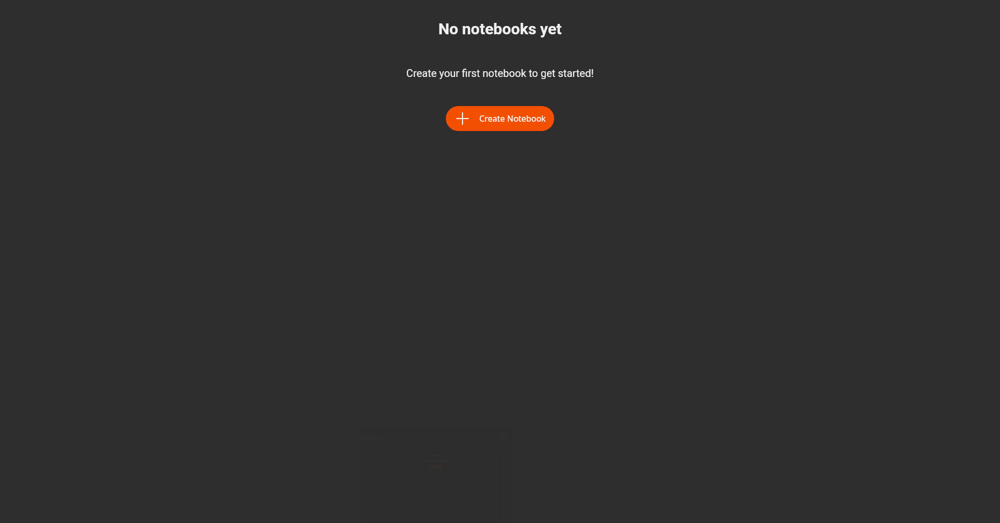
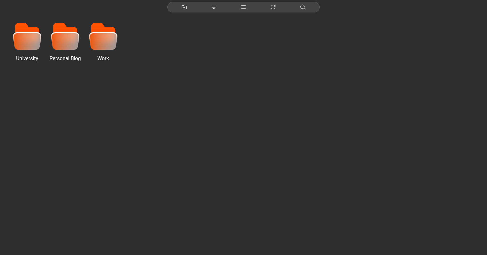
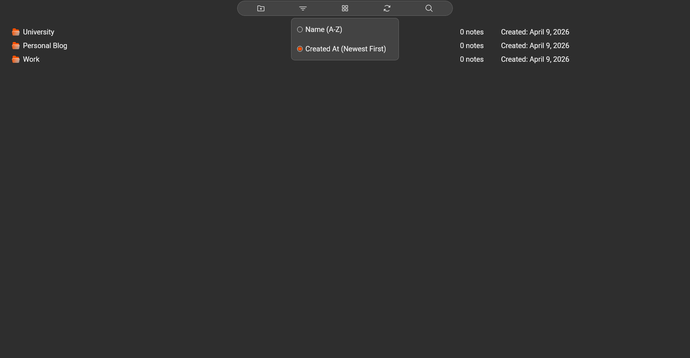
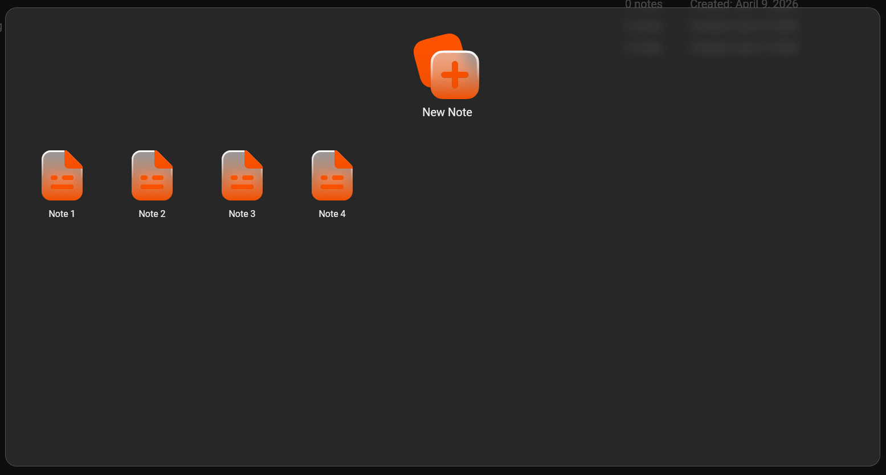
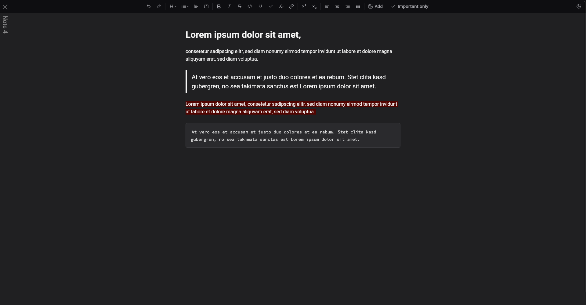
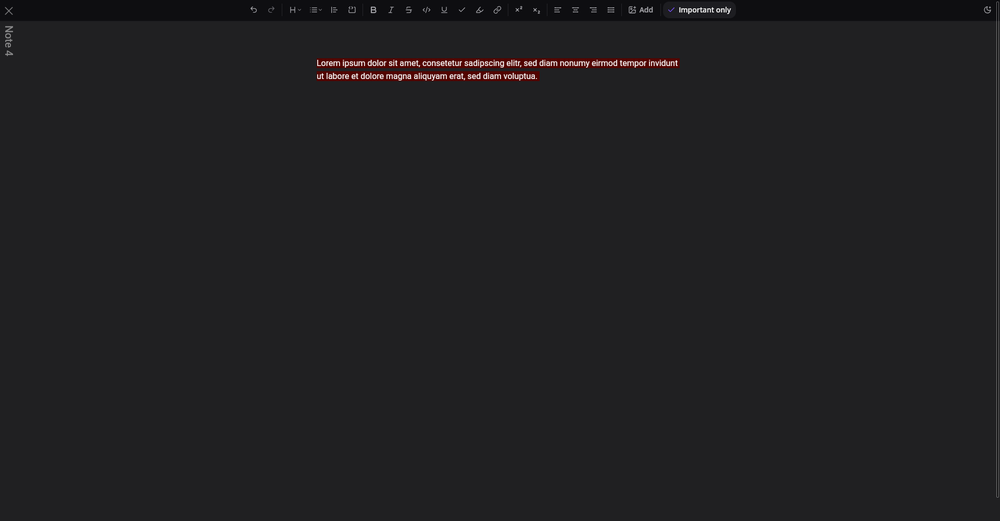
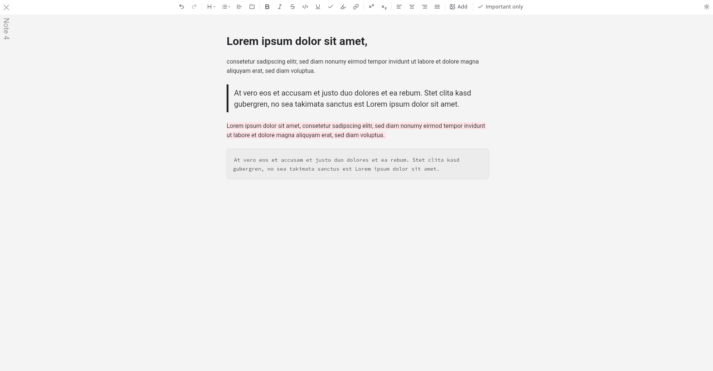

# Notary

**Notary** is a local-first desktop note-taking app built with **Tauri + React + TipTap**.
It combines a fast notebook explorer with a powerful rich-text editor and stores all data locally in SQLite.

---

## Product Overview

Notary is built for focused, everyday work:

- **Local-first:** No cloud dependency, no account required, direct on-device storage.
- **Fast access:** Notebooks and notes in a clean explorer structure.
- **Rich text without bloat:** Formatting, lists, code blocks, links, images, and highlights.
- **Ready to use:** Minimal UI, short learning curve, fast onboarding.

---

## Screenshots

### 1) Explorer & Notebook Management



Initial Notebook Explorer state on first app launch, guiding the user to create the first notebook and start adding notes.



Notebook overview in grid layout, highlighting the folder-card design and visual clarity.

### 2) Daily Note Workflow



Detailed list view for notebooks, including metadata and sorting workflow.



Notes overlay for a selected notebook, where users can create, open, and browse notebook-specific notes.

### 3) Editor Experience



Rich-text (Markdown-style) editor capabilities in dark mode using general lorem ipsum content.



"Show important only" mode in action for focused reading of highlighted important content.



Editor in light mode, demonstrating the built-in light/dark theme toggle.

---

## Feature Breakdown

### Notebook Explorer

- Create, rename, and delete notebooks
- Search notebooks with live filtering
- Sort by name or creation date
- Toggle between grid and list layout
- Right-click context menus
- Empty-state onboarding with clear “Create Notebook” guidance

### Note Management

- Create and open notes per notebook
- Rename note titles and delete notes
- Persist last opened note (`localStorage`)
- Fast switching between explorer and editor view

### Rich-Text Editor (TipTap)

- Headings, lists (bullet/ordered/task), blockquote, code block
- Inline styles: bold, italic, underline, strike, inline code
- Extended styles: multicolor highlight, superscript, subscript
- Text alignment: left, center, right, justify
- Link insertion and editing
- Image insertion with upload handling
- “Important only” mode for focused reading
- Undo/redo and debounced autosave
- Theme toggle (light/dark)

---

## Architecture

### Frontend

- **React 19** + **Vite**
- Component-based UI
- CSS Modules + SCSS for maintainable styling

### Desktop Runtime

- **Tauri v2** for native desktop execution
- Rust-based shell with a webview frontend

### Data Layer

- **SQLite** via `@tauri-apps/plugin-sql`
- Tables:
	- `notebooks`: `id`, `name`, `created_at`, `notes_count`
	- `notes`: `id`, `notebook_id`, `name`, `content`, `important`, `created_at`
- Rich-text content is stored as TipTap JSON

---

## Tech Stack

- **Frontend:** React 19, Vite 7
- **Desktop:** Tauri 2
- **Editor:** TipTap 3
- **Database:** SQLite (`@tauri-apps/plugin-sql`)
- **UI Icons:** Phosphor Icons
- **Styling:** CSS Modules, SCSS

---

## Setup & Development

### Prerequisites

- Node.js (LTS recommended)
- npm
- Rust Toolchain (`rustup`, `cargo`)
- Tauri v2 prerequisites (Linux: e.g. WebKitGTK + build tools)

Official Tauri documentation:

- https://tauri.app/start/prerequisites/

### Installation

```bash
npm install
```

### Development

Frontend only (Vite):

```bash
npm run dev
```

Desktop app (Tauri + frontend):

```bash
npm run tauri dev
```

### Build

Frontend build:

```bash
npm run build
```

Native Tauri bundles:

```bash
npm run tauri build
```

---

## Project Structure

- `src/` – React app, UI components, editor, styles
- `src/components/NotebookExplorer.jsx` – notebook/note explorer
- `src/components/tiptap-templates/simple/simple-editor.jsx` – editor template
- `src/lib/db.js` – SQLite CRUD + data access layer
- `src-tauri/` – Tauri/Rust configuration and native runtime
- `public/` – static assets and screenshots

---

## Engineering Highlights

- Clear separation between UI, editor logic, and data access
- Local persistence for speed and data ownership
- Extensible TipTap stack with custom extensions
- Tauri desktop architecture for lower runtime overhead

---

## Changelog

All changes are documented in [CHANGELOG.md](CHANGELOG.md).
